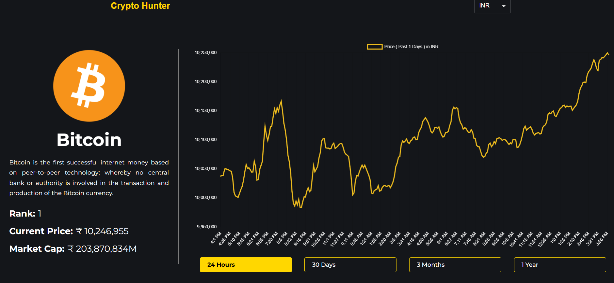

<style>
  .hero-images {
    display: flex;
    flex-wrap: wrap;
    justify-content: center;
    gap: 1rem;
  }

  .hero-images img {
    width: 100%;
    max-width: 500px;
    height: 300px;
  }

  @media (min-width: 768px) {
    .hero-images {
      flex-direction: row;
    }
    .hero-images img {
      width: 48%;
    }
  }

  @media (max-width: 767px) {
    .hero-images {
      flex-direction: column;
    }
    .hero-images img {
      width: 100%;
    }
  }
</style>

<br/>
<div align="center">
<div class="hero-images">
  
  
</div>
  <br/>
  <div style={"margin-top:2px"}>
    
    
    
    
    
    
  </div>

  <h3 align="center">📈 CryptoHunter — Real-time Crypto Dashboard</h3>

  <div align="center">
    A modern and responsive cryptocurrency tracking dashboard built with React 19, MUI, and Chart.js. Displays real-time market stats and charts from CoinGecko API.
  </div>

  <br />
  <div align="center">
    🌐 <strong>Live Demo</strong>: <a href="#">Coming Soon</a>
  </div>

  <br />
  <div align="center">
    <a href="https://github.com/karthickramalagar">
      
    </a>
    <a href="https://linkedin.com/in/karthickeyan-ramalagar-763404370/">
      
    </a>
    <a href="mailto:karthickramalagar@gmail.com">
      
    </a>
  </div>
</div>

---

## 📋 Table of Contents

1. [Introduction](#-introduction)
2. [Tech Stack](#-tech-stack)
3. [Features](#-features)
4. [Quick Start](#-quick-start)
5. [Installation](#-installation)
6. [License](#-license)
7. [Acknowledgements](#-acknowledgements)

---

### 🚀 Introduction

**CryptoHunter** is a full-featured crypto tracker that uses the CoinGecko API to display market data.  
The app supports responsive design, chart visualizations, dynamic coin detail pages, and more.

---

### 🔧 Tech Stack

- ⚛ **React 19**
- ⚡ **Vite** — Lightning-fast bundler
- 🎨 **Material UI (MUI v7)** — Modern component library
- 📊 **Chart.js + react-chartjs-2** — Chart visualizations
- 🔄 **React Router v7** — Client-side routing
- 📦 **html-react-parser** — To render HTML descriptions
- 🛞 **React Alice Carousel** — Interactive sliders

---

## ⚙ Features

- ✅ Real-time crypto data from CoinGecko API
- 📉 Interactive coin charts
- 🧭 Clean sidebar with live prices
- 🖼 Responsive UI
- 📍 Coin detail routing
- 🌙 Built with Material UI theme support

---

## ⚡ Quick Start

### 📦 Prerequisites

- Node.js ≥ 18
- npm (or pnpm/yarn)

### 🛠️ Installation

```bash
git clone https://github.com/KarthickRamAlagar/cryptoHunter.git
cd cryptohunter
npm install
```

Start development server

```bash
npm run dev
```

Build for production

```bash
npm run build
```

🙏 Acknowledgements

- CoinGecko API
- React
- Vite
- Material UI
- Chart.js
- React Router
